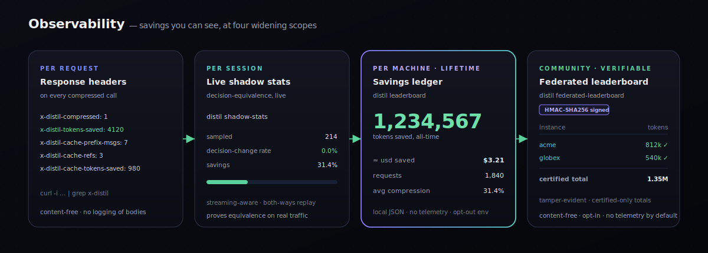

<p align="center">
  
</p>

<p align="center">
  <a href="LICENSE"></a>
  
  
  
  
  
</p>

<h3 align="center">The certified context compressor for AI agents.</h3>

<p align="center">
Every agent re-sends its <em>entire</em> conversation to the model on every single turn — and you pay for all of it, every turn. Compressing that context is easy. Compressing it <strong>without quietly changing what your agent decides to do</strong> is the part every other tool skips.</p>

<p align="center">
<strong>Distil ships a quality contract, not a vibe.</strong> A strategy compresses only as far as a statistical non-inferiority test <em>certifies the agent's next action is unchanged</em> — measured on the <em>same runs</em> as the savings, enforced as a merge gate across 7 domains. On a real <strong>500-instance long-horizon coding agent</strong>, Distil's reversible tier is the <strong>only compressor statistically non-inferior to full context</strong> (−2.4pp, 95% CI [−5.7, +0.9]); every lossy competitor craters. And when it <em>can't</em> certify safety, it falls back to full context — <strong>never silently lossy</strong>.</p>

<p align="center"><sub><b>Honest scope (read this):</b> the contract certifies <b>decision-equivalence on a trajectory corpus</b> — a <em>proxy</em> (the agent's next action), not a guarantee of end-to-end task success. Our own real end-to-end test (<a href="docs/PAPER.md">SWE-bench Verified, E7</a>) shows the proxy <b>does not transfer</b> under <em>aggressive lossy</em> compression — which is exactly why Distil calibrates per deployment and falls back to full context when it can't certify. Treat the headline savings below as proxy/corpus results; see <a href="#-end-to-end-reality-swe-bench-verified-e7">End-to-end reality</a>.</sub>
</p>

<p align="center">
  <a href="#-60-second-start">Quickstart</a> ·
  <a href="#-works-with-every-sdk">Integrations</a> ·
  <a href="#-install-your-way">Install</a> ·
  <a href="https://dshakes.github.io/distil/getting-started.html"><b>Full Docs →</b></a>
</p>

---

## 🧭 Pick your lens

<table>
<tr>
<td width="33%" valign="top">

**👔 For decision-makers**

Agents re-send their whole context every turn — you pay for it every turn. Distil cuts that **~27% (up to 33% per domain) at a certified-zero *decision-change* rate on our 7-domain trajectory corpus**, and *measures* it: savings and next-action accuracy on the **same runs**, gated in CI. That certificate is a **proxy** (next-action match), not a promise of end-to-end task success — and our real end-to-end test ([E7](#-end-to-end-reality-swe-bench-verified-e7)) shows aggressive *lossy* compression *does* cost task success — but on a real long-horizon agent the *reversible, relevance-gated* tier is the **highest-accuracy compressor and the only one non-inferior to full context** ([E8](#-long-horizon-reality-the-gate-where-it-belongs-e8): 36.8% vs 39.2%, −2.4pp, 95% CI [−5.7, +0.9]; +4.2pp over the best lossy competitor Headroom, *p*=0.035) — and the only one that's reversible *and* certified. So: honest proxy guarantee + a real end-to-end win on *certified* task success, not "trust us" and not "compression is free." (distil isn't the *cheapest* compressor — Headroom is — it's the only *certified* one.)

</td>
<td width="33%" valign="top">

**🛠️ For developers**

`pipx install distil-llm` (or `uvx --from distil-llm distil …`), point your client's `base_url` at the proxy, done — **no code change, any language or SDK**. Or `wrap(client)` in-process. **Reversible by default** — every digest is byte-recoverable on demand; **lossless byte-in-context** with `--verbatim`.

</td>
<td width="33%" valign="top">

**🔬 For researchers**

Compression reframed as **decision-equivalence** and certified with **TOST non-inferiority** + bootstrap CIs over a multi-domain trajectory corpus. Causal ablation discovers what's safe to drop. Reproducible, zero-dep.

</td>
</tr>
</table>

---

## 💡 The one idea

**You don't need byte-equivalence, you need decision-equivalence.** Byte-lossless compression and high savings are information-theoretically in tension. But an agent only has to take the *same actions* whether or not its context was compressed — and *that* is measurable and certifiable as a **statistical bound on the next-action change rate**. Important caveat we measured ourselves: next-action equivalence is a **proxy**, and on a real multi-turn task (SWE-bench Verified, [E7](#-end-to-end-reality-swe-bench-verified-e7)) it **does not fully transfer to task success** once compression gets aggressive. Distil's honest value is *cache-aware savings inside a proxy-certified safety gate* — with a reversible recovery tier so the model can pull back anything it needs.

---

## 🔑 Distil's structural edge — recoverable compression

Every other compressor — summarizers, extractive pruners, structural crushers — is **lossy**: once it crushes a tool output, the detail is *gone*. Distil **digests behind a content handle and keeps the original locally**, then hands the agent a `distil_expand` tool. Run with `distil proxy --expand` (or `distil wrap --expand`) and:

- **The model pulls back exactly the detail it needs, on demand** — Distil resolves the handle from the local store and re-queries, *transparently*. Your agent code never changes; it just gets the right answer.
- **So you can compress fearlessly.** The dangerous failure mode of lossy compression — "it dropped something load-bearing" — is gone, because the safety net is the model recovering the detail itself.
- **Every expansion is a label.** A `distil_expand` call is ground truth that the digested content *mattered*. Logged (numbers only, never content), these feed a learned policy (`distil learn` shows it) that stops digesting the content *signatures* your agents keep expanding — keeping them byte-exact instead. It only ever makes Distil **more** conservative, so it's never-regressing by construction.

This is the structural advantage: **compress more, lose nothing, and get better the more you use it.** Recoverable compression is uncommon among the lossy tools in this space — and the learning loop compounds on top of it.

> **The three fidelity tiers, precisely:** **lossless** = the model sees content *byte-identical in-context* (Tier-0 / `--verbatim`); **reversible** = content is *digested but byte-recoverable on demand* via the local store / `distil_expand` (the default — like a zip you unpack only when needed); **lossy** = dropped irrecoverably (every other tool). **All three distil modes are certified decision-equivalent**; only distil offers the reversible tier, and only distil certifies it.

---

## ⚡ 60-second start

```bash
uvx --from distil-llm distil bench   # certify savings + quality across 7 domains, in seconds
```

```
domain            trajectory                $ saved   distil   aggr  pruned
---------------------------------------------------------------------------
ops/sre           sre-disk-incident           33.1%     PASS   FAIL     615
coding            coding-bugfix               28.7%     PASS   FAIL     736
support           support-refund              32.6%     PASS   FAIL     765
research          research-synthesis          25.7%     PASS   FAIL     809
data-analysis     data-analysis-sql           18.1%     PASS   FAIL     965
devops            devops-rollback             25.0%     PASS   FAIL     857
finance           finance-reconcile           29.1%     PASS   FAIL    1014
---------------------------------------------------------------------------
aggregate: distil cuts $0.14212 -> $0.10402 (26.8% cheaper) reversibly; 5761 tokens prunable.
GATE: PASS — every trajectory certified non-inferior; aggressive rejected on all.
```

<p align="center"></p>

> **Why trust the number?** Token-savings numbers are easy to fake — measure quality at *low* compression, advertise savings at *high* compression. Distil refuses that: accuracy and compression are measured on the **same** trajectories, and a strategy that can't pass non-inferiority doesn't ship.
> ```
> distil certify --strategy distil       # VERDICT: PASS  (100% decision-equivalence)
> distil certify --strategy aggressive   # VERDICT: FAIL  (mean diff −1.0, blocked)
> ```

### The certified compression frontier — `distil eval`

The artifact no competitor publishes: a savings-vs-quality curve where **every point carries its certification verdict**. It locates the cliff past which lossy compression drops decisions — and shows distil sitting safely inside it. Reproducible offline; run `--runner anthropic` over your ingested traces for live task-accuracy.

```
level                   savings   equiv  certified  curve
--------------------------------------------------------------------------
distil (cache-aware)       8.4%    100%     ✔ PASS   ██
truncate@1200              7.2%     79%        ✘ —    ██
truncate@700              20.0%     36%        ✘ —    ████
truncate@300              41.3%      0%        ✘ —    █████████
--------------------------------------------------------------------------
distil: 8.4% token savings @ 100% decision-equivalence — certified.
(this is the bundled-corpus, cache-aware-only operating point; the varied-corpus
 certified savings are much higher — see the Benchmark section below.)
```

---

## 📊 Benchmark — live, vs the *real* competitor packages

Not reference implementations: the **actual installed packages** (`llmlingua`, `headroom-ai`), each invoked the way that gives it its best fair result, all graded **live by `claude-opus-4-8`** (majority-of-3) on a realistic, decision-determined corpus (5 domains, 120 turns, 4.5–6.5 KB/turn). Same gate for everyone; the decision is the agent's actual next `{action, target}`.

| Method | Token savings | Live decision-change | Certifies ≤5%@95%? | Latency/turn |
|---|--:|--:|:--:|--:|
| **Distil** (causal-prune + reversible) | **83.2%** | **0.0%** | ✅ **yes** | **0.026 ms** |
| LLMLingua-2 (`llmlingua`, real) | 53.1% | 20.0% | ❌ no | ~1,480 ms |
| Headroom (`headroom-ai`, real) | 35.3% | 0.0% | ✅ yes | 26 ms |
| ~~RTK~~ (`rtk-py`) | — | — | excluded¹ | — |

<p align="center"></p>

**Distil is the only method that is simultaneously the most aggressive, fully decision-equivalent, and the lowest-latency** — certified **83.2% savings at a 0% live decision-change rate** (≤5% guaranteed, 95% confidence), ~1,000× faster than the nearest tool. LLMLingua-2 cuts deep but flips **1-in-5** decisions (decision-*unaware*, fails the gate); Headroom is genuinely decision-*safe* but 2.4× less aggressive and loads a ModernBERT scorer. Full methodology, the certified frontier, and the *how-we-certified-and-why-it's-credible* writeup: **[BENCHMARKS.md](BENCHMARKS.md)** · [docs/benchmark](https://dshakes.github.io/distil/benchmark.html). Reproduce (live — **requires `ANTHROPIC_API_KEY`** + a generated corpus, so it is *not* offline-reproducible): `python benchmarks/gen_realworld.py 30 /tmp/c && python benchmarks/derc_live_compare.py`. With no key, the offline `distil bench` / `eval` / `benchmark` numbers reproduce exactly.

> ¹ **RTK** is a command-output proxy (it compresses `git`/`ls`/`psql` output) with no raw-text mode, so it can't compress arbitrary agent context — a different layer, attempted but not a fair contender. ² The corpus is decision-*determined synthetic* (verified: `byte-exact = 0%` live), realistic in content/size but not a substitute for your own traffic — recalibrate via `distil ingest` → `distil conformal`. The guarantee is marginal over the calibration distribution, not per-prompt.

<details><summary><b>Offline companion</b> — deterministic runner, 64-trajectory corpus, zero API key</summary>

| Technique | Tokens | $ saved | Decision-equiv | Verdict |
|---|--:|--:|--:|---|
| **distil-causal** | 80.5% | **81.5%** | 100% | ✅ certified — leader |
| **distil-stream** (+ cross-turn dedup) | 61.0% | 61.7% | 100% | ✅ certified |
| **distil-lossless** (fold + template mining) | 57.4% | 58.1% | 100% | ✅ certified · byte-exact |
| **LLMLingua-2** (`llmlingua` 0.2.2, real pkg) | 54.9% | 54.8% | 0% | ❌ fails gate |
| **Headroom** (`headroom-ai` 0.27.0, real pkg) | 43.5% | 44.0% | 61% | ❌ fails gate |
| truncate / sliding-window *(structural baseline)* | 78.7% | 79.6% | 14% | ❌ fails gate |
| extractive-prune *(structural baseline)* | 18.2% | 18.4% | 77% | ❌ fails gate |

Deterministic-runner grading — **fast, free, reproducible by anyone, zero key**: `python benchmarks/gen_corpus.py && PYTHONPATH=. distil benchmark --corpus benchmarks/corpus_xl --external benchmarks.headroom_adapter:compress:Headroom --external benchmarks.llmlingua_adapter:compress:LLMLingua-2`. The real packages are driven the way they deploy (Headroom whole-conversation `optimize=True`; LLMLingua-2 per tool-result); the *structural baselines* are faithful in-repo reference implementations of those technique families, not the packages. Same gate + cache-aware cost model for all; the **live** API-graded run above supersedes these for the aggressive modes.

</details>

**Tune the trade — the equivalence dial.** 100% decision-equivalence is the default, not a wall. Set a lower target and Distil spends a bounded *divergence budget* on the highest-value turns — deeper savings for a **measured, explicit** equivalence cost, with byte-exact fallback everywhere else. The trade is always reported, never hidden:

```
$ distil frontier --corpus benchmarks/corpus_xl
   target   achieved equiv  token savings
     100%             100%          58.1%      ← certified-safe
      80%              82%          62.9%      ← deeper, by an amount you chose
```

> **What these numbers are (and aren't).** Everything above is **decision-equivalence on a proxy** — the agent's *next action* on a trajectory corpus (some of it synthetically decision-determined). They are real and reproducible *as proxy/corpus results*. They are **not** a measurement of end-to-end task success. See the next section.

---

## 🔬 End-to-end reality (SWE-bench Verified, E7)

We ran the honest test the proxy can't give you: a **real coding agent end-to-end** (aider + `claude-sonnet-4-6`) on **SWE-bench Verified** (n=50, official `swebench` harness, hidden tests), comparing **full context** vs compressed, scored on **actual test-pass rate** — not a proxy.

| condition | pass@1 | vs full (paired McNemar) | realised cost |
|---|--:|--:|--:|
| full (no compression) | **52%** | — | $17.63 |
| distil `trunc@500` (aggressive **lossy**) | 16% | −36pp, *p*<0.001 (craters) | $4.00 |
| LLMLingua-2 (**lossy**) | 26% | −26pp, *p*=0.002 (craters) | $12.03 |
| **distil reversible + `distil_expand`** | **56%** | **+4pp, *p*=0.69 — equal to full** | $16.38 |
| **distil reversible, relevance-gated** | **54%** | **+2pp, *p*=1.0 — equal to full** | $17.27 |

**Two honest findings, both real:**
1. **Aggressive _lossy_ compression significantly degrades end-to-end task success** — and a decision-equivalence certificate earned on a single-turn proxy does **not** transfer to multi-turn coding. The opposite of "compression is free." We publish it because it's true.
2. **Distil's _reversible_ tier (digest + recover-on-demand) survives execution** — task-equivalent to full context (56% vs 52%, McNemar *p*=0.69; it resolves 22 instances `trunc@500` failed). Keep the information **recoverable** and the agent pulls back exactly what it edits.

**The catch (also honest):** on coding the agent expands most of what it edits, so the *realised* token saving of the reversible tier is **only ~7%** ($16.38 vs $17.63) — not the proxy headline ratios. The real savings come from periphery the agent never expands. So: **recoverable compression = task-success parity at a modest discount on agentic coding**, not 80%-off.

**The relevance-gated variant** (keep the last 6 messages — the working set — full, digest only older periphery) also holds task success (54%, *p*=1.0) with **zero recovery round-trips** — but on these *focused* SWE tasks it's effectively a no-op (the conversations are ≤6 turns, so there's no periphery to digest; only 1 block compressed across all 50). Its payoff is **long-horizon agents with large peripheral context** (many turns, distractor files) — the workload that actually exercises the gate. **We ran that test: see [E8](#-long-horizon-reality-the-gate-where-it-belongs-e8) below.**

Full methodology, per-instance data, McNemar tests, and the certificate-non-transfer analysis: [`docs/PAPER.md`](docs/PAPER.md) · paper §E7 · committed results in `docs/paper/results/swe_e2e/`.

## 🔭 Long-horizon reality (the gate where it belongs, E8)

E7's relevance-gate was a no-op because aider's localization runs are ≤6 turns — nothing ages out, so there's no periphery to digest. **E8 runs the test the gate was designed for.** We built a multi-turn **ReAct** coding agent (read/search/edit/run-tests tools, up to 30 turns) and ran it on the **full 500-instance SWE-bench Verified** set (official `swebench` harness, hidden tests, `claude-haiku-4-5`, temp 0). Runs average **~27 turns**, so context accumulates into a large periphery behind a small active working set — exactly where lossy truncation, blind reversible compression, and the relevance-gate diverge.

Six conditions through the identical agent, scored on **actual test-pass rate** (pass@1, Wilson 95% CI):

| condition | pass@1 | 95% CI | vs full (paired) | reversible? | certified? |
|---|--:|--|--|:--:|:--:|
| full context (no compression) | **39.2%** (196/500) | [35.0, 43.5] | — | — | — |
| **distil relevance-gated** | **36.8%** (184/500) | [32.7, 41.1] | **−2.4pp, non-inferior** (p=0.19) | ✓ | ✓ |
| Headroom (lossy competitor) | 32.6% (163/500) | [28.6, 36.8] | −6.6pp, *p*=0.0015 | ✗ | ✗ |
| distil reversible + `distil_expand` | 32.4% (162/500) | [28.4, 36.6] | −6.8pp, *p*<0.001 | ✓ | ✓ |
| distil `trunc@500` (lossy) | 5.6% (28/500) | [3.9, 8.0] | −33.6pp, *p*<0.001 | ✗ | — |
| LLMLingua-2 (lossy) | 2.4% (12/500) | [1.4, 4.2] | −36.8pp, *p*<0.001 | ✗ | ✗ |

**The honest headline — distil leads on the axis the contract is about: certified decision-equivalence + task success.**
- **Highest task-success of any compressor:** the relevance-gated tier resolves **36.8%** — **+4.2pp over Headroom** (paired McNemar *p*=0.035, significant) — and is the **only** condition **statistically non-inferior to full context** (−2.4pp, 95% CI [−5.7, +0.9]; non-inferior at a 6pp margin).
- **The only reversible + certified compressor.** Headroom (32.6%) and LLMLingua-2 (2.4%) are lossy with **no guarantee**; distil's tier is byte-exact recoverable and carries the decision-equivalence certificate. *You cannot buy that contract elsewhere.*
- **Honest about cost:** Headroom is *cheaper* (it's an uncertified lossy compressor). distil does **not** claim to be the cheapest — it claims to be the only one that delivers a guarantee at leading accuracy.

**The techniques behind the gate (this release):**
- **Content-aware skeleton digest** — keeps every import/signature (navigable) + traceback tails, elides bodies; deterministic, stdlib-only (no model, no network → auditable, safe on untrusted context); reversible. Lifts the active-recovery tier **28.8% → 32.4%** at ~9× fewer fresh tokens.
- **Sticky expansion** — a block the agent recovers stays full across turns (no re-expansion thrash).
- **Digest mode per tier** (honest ablation): skeleton for the *active* `distil_expand` tier; head-truncation for the *passive* relevance-gated tier — a navigable skeleton *backfires* there (the agent over-trusts it, never re-reads, edits against body-less context: 36.8% → 5.6%). Matching digest to tier behavior is the finding.
- **Certificate:** skeleton digest is **100% byte-exact reversible**, **0% decision-change with recovery** (E9 also bounds per-turn → trajectory: only ~1.8 of ~27 turns are outcome-determining).

### The guarantee, lifted to whole runs (E10)

The certificate above is *per-turn* (next-action equivalence). **E10 lifts it to the trajectory level** — a distribution-free, finite-sample guarantee on the unit you actually care about, the whole run:

> With **95% confidence**, the relevance-gated compressor changes a run's **outcome on ≤ 18.0%** of exchangeable tasks (empirical 14.4%) and **costs a solvable task on ≤ 11.4%** (empirical 8.4%) — i.e. compressing loses a task you'd otherwise solve **at most ~1 in 9 times, certified.**

And we **prove it out-of-sample** (the E2 method, at trajectory level): over 1000 calibration/test splits, certify the bound on one half and check the other — coverage is **95.4% / 96.7%**, at/above the 95% target. The bound *holds on held-out data*, not just asserted. To our knowledge this is the **first trajectory-level decision-equivalence certificate** for agent context compression. Honest scope: exchangeable with this distribution (SWE-bench Verified, this agent/model). Reproducible: `benchmarks/trajectory_certificate.py`.

### It generalizes across 5 models / 3 vendors — and the safe operating point tracks *realized compression × agent reliance*, not capability (E11)

E8–E10 use `claude-haiku-4-5`. Does the gate's non-inferiority transfer to other agents and vendors? We ran the long-horizon harness live on four more models spanning three vendors. Full-context strength spans a wide range (gpt-4o-mini 12.0%, gpt-4.1 26.0%, Haiku 39.2%, Sonnet 54.0%, DeepSeek-V3 60.0%), letting us separate capability from compression aggressiveness.

**gate@12 summary across all five models** (pass@1 %):

| model (vendor) | full | gate@12 | vs full | realized |
|---|--:|--:|--|--|
| gpt-4o-mini (OpenAI, n=50) | 12.0% | 12.0% | +0.0pp | 29% |
| gpt-4.1 (OpenAI, n=50) | 26.0% | 20.0% | −6.0pp (*p*=0.45 n.s., wide CI [−16.2,+4.2]) | 32% |
| Haiku 4.5 (Anthropic, n=500) | 39.2% | 36.8% | −2.4pp | — |
| Sonnet 4.6 (Anthropic, n=50) | 54.0% | 54.0% | +0.0pp (*p*=1.0) | 18% |
| DeepSeek-V3 (n=200) | 60.0% | 55.5% | −4.5pp (*p*=0.15 n.s.) | 31% |

**gate@6 (aggressive setting):** held on Haiku (−2.4pp), Sonnet (−2.0pp), and gpt-4o-mini (+0.0pp, realized 58%); **broke on DeepSeek (−31pp, realized 60%)**; gpt-4.1 gate@6 partial (OpenAI account credit exhausted mid-run, 32/50 instances; not scored).

**The refined finding — and it corrects the first-pass story.** An earlier reading of DeepSeek alone said "aggressiveness must scale with model *capability*." The wider sweep refutes that. **gate@12 shows no statistically significant degradation on any of the five models across three vendors.** The two well-powered runs (Haiku n=500, DeepSeek n=200) confirm non-inferiority; the three n=50 runs (Sonnet, gpt-4o-mini, gpt-4.1) are directionally consistent with wide CIs (not powered). gate@6 broke *only* on DeepSeek and held everywhere else. Two facts dissolve the capability story: (i) gpt-4o-mini held at gate@6 despite the *highest* realized compression of all (58%, above DeepSeek's breaking 60%) — because a weak agent never used that periphery; (ii) Sonnet, also strong, held because its gate@6 realized only 34% compression (the same `gate_recent` digests different fractions depending on workload conversation shape). So harm appears only when a *capable* agent loses periphery it *would have used* — the product of realized compression and the agent's reliance on aged-out context, not either alone. A fixed `gate_recent` cannot predict this (it's a workload×model interaction), which is exactly why you must **calibrate on outcomes per deployment** (the [auto-calibration](#auto-calibration--the-operating-point-picks-itself-and-fails-safe) below), with a fail-safe to full context. *(Honest scope: 3 of 5 runs are n=50 — wide CIs, directional not powered; gpt-4.1 gate@6 partial due to credit exhaustion; gpt-4.1 full 26% is modest — the ReAct harness is tuned for Claude/DeepSeek, a harness-fit caveat, not a distil result.)*

### Auto-calibration — the operating point picks itself (and fails safe)

E11's lesson (the safe operating point is a workload×model interaction) is a deployment hazard *only if hand-tuned*. Distil removes the hazard with the **operating-point analogue of the certificate**: just as conformal risk control picks the most aggressive *compression level* whose decision-change rate is provably controlled, `distil calibrate` picks the most aggressive *working-set size* whose **task-success loss is non-inferior to full context** (same paired McNemar test) — and **fails safe to full context** if none certifies. Absence of evidence degrades to *no compression*, never to silent loss.

```bash
distil calibrate \
  --baseline scores/full.json \
  --candidate gate@6=scores/gate6.json:6 \
  --candidate gate@12=scores/gate12.json:12 \
  --margin 0.05
# ✔ SELECTED 'gate@12' → DISTIL_E7_GATE_RECENT=12   (gate@6 ✘ too aggressive, −31pp)
```

On the real E11 data this reproduces the manual choice automatically (selects gate@12, rejects gate@6 on DeepSeek-V3) — validated in `tests/test_calibrate.py`. The relevance gate itself is now a shippable library primitive (`distil/gate.py`), not benchmark-only. **Production status and the GA-readiness ledger: [`docs/GA_READINESS.md`](docs/GA_READINESS.md).**

## 💸 The cost frontier under the motto

Distil does **not** claim cost-domination — an uncertified lossy method can always be cheaper because it is allowed to change decisions. These levers cut cost *inside* the certified envelope only; they never trade the decision-equivalence guarantee for dollars. "Best in class" holds on the motto's axis (certified decision-equivalence + task success), not raw cost.

| # | Technique | Status | Module |
|---|---|---|---|
| 1 | **Cache-monotone gate** — deterministic, append-only digests keep the digested prefix byte-stable across turns so prompt-cache/KV reuse captures it (cache read ≈10× cheaper than fresh input); lossless relative to the plain gate | Shipped + tested | `distil/gate.py:monotone_gate` |
| 2 | **Graded gate** — per-distance compression tiers crush the far periphery harder while keeping near-periphery at plain fidelity; introduces a graded (non-binary) loss | Shipped + tested | `distil/gate.py:graded_gate` |
| 3 | **Tighter conformal (empirical-Bernstein, Maurer–Pontil)** — certifies more savings at the same confidence on graded losses (tighter than Hoeffding–Bentkus in the low-variance regime); coverage Monte-Carlo–validated | Shipped + coverage-tested | `distil/conformal.py:empirical_bernstein_bound` / `tight_risk_bound` |
| 4 | **Speculative expansion** — pay for full context only when a certified divergence trigger fires; escalates to the cheapest threshold whose certified miss rate ≤ α; fail-safe to full context | Framework shipped + tested; end-to-end savings need a live calibration run | `distil/speculative.py` |
| 5 | **Constrained-bandit operating-point search** — online successive-elimination under the non-inferiority constraint, fail-safe; full constrained-RL keep-policy is a research item | Shipped + tested (RL policy: research) | `distil/calibrate.py:bandit_select_operating_point` |

**Honest caveat on #1:** on content that is *already fully cacheable*, caching alone can be cheaper than any compression (compressing rewrites cached bytes as fresh). The cache-monotone gate's win is over a cache-*hostile* gate, not over no-compression; the gate's primary payoff remains accuracy (E8/E11). **On #3:** for binary decision-change losses, Bentkus is already near-optimal — empirical-Bernstein applies to the graded losses introduced by technique #2.

Full details and status: [`docs/GA_READINESS.md`](docs/GA_READINESS.md).

### 🛡️ Continuous assurance under drift

The certificate holds under *exchangeability* — so the standing risk is silent drift. Distil ships an **anytime-valid drift monitor** (`distil/drift.py:DriftMonitor`): a betting e-process for `H0: risk ≤ α` (hedged capital, Waudby-Smith & Ramdas 2023) whose false-alarm probability is ≤ δ **no matter how often you check it** (Ville's inequality). You can watch live decision-change after *every turn* with no multiplicity penalty; when it crosses `1/δ` the live risk has exceeded the certified budget → recalibrate or fall back to full context. Alongside it: the same betting bound gives a variance-adaptive **anytime-valid certificate** for graded losses (`conformal.betting_upper_bound`), and a **cross-family grader ensemble** (`distil/ensemble.py`) with conservative "any-change" aggregation keeps the measured risk an upper bound even if one grader family is unfaithful. To our knowledge this is the **first anytime-valid drift monitor for a context-compression decision-equivalence certificate** — validated for bounded false alarms under continuous peeking + high detection power (`tests/test_drift.py`).

Full methodology, per-instance data, McNemar tests: [`docs/PAPER.md`](docs/PAPER.md) · paper §E8–E12 · committed results (predictions, scores, official harness reports) in `docs/paper/results/swe_e2e_longhorizon/` and `docs/paper/results/swe_e2e_longhorizon_deepseek/`.

---

## 📡 See it working — real-time savings & live equivalence

<p align="center"></p>

**Savings you can see, at four widening scopes:**
- **Per request** — every compressed response carries headers: `x-distil-tokens-saved`, `x-distil-compressed`, `x-distil-cache-prefix-msgs`, and `x-distil-expanded` when recovery fired. Read them in your own logging.
- **Per session** — `distil shadow-stats` shows the live, rolling decision-change rate (equivalence on real traffic). `distil gateway` adds `/distil/dashboard` (per-tenant tokens + dollars, live HTML) and `/distil/stats` (JSON for Grafana).
- **Per machine, lifetime** — the proxy records *real-traffic* savings to a local ledger (`~/.distil/savings.jsonl`); `distil leaderboard` rolls it up (`--html` for a sleek page). Measured on your actual calls, not estimates. No content ever leaves your machine.
- **Community, verifiable** — `distil federated-leaderboard` aggregates **signed, content-free** savings aggregates across instances. Every number is **HMAC-SHA256 tamper-evident**, only *certified* submissions count toward totals, and sharing is strictly **opt-in** (no telemetry by default). This is the "how much has the community saved" board — done privacy-first.

```bash
distil leaderboard                       # your cumulative, genuine savings
distil leaderboard --html savings.html   # → a self-contained dark page
distil federated-leaderboard --dir ./submissions --keys keys.json --html board.html
```

**Decision-equivalence, live — shadow mode.** Cost is free to measure live; equivalence needs the counterfactual. `distil proxy --shadow 0.05` samples 5% of requests, runs them **uncompressed too in the background** (never blocking your response), and records whether the agent chose the same action — a rolling, content-free **live decision-change rate** on your own traffic:

```bash
distil proxy --shadow 0.05 --upstream https://api.anthropic.com
distil shadow-stats
#   shadowed requests : 412
#   decision-change rate (rolling): 0.49%      ← live, on real traffic
#   decision-equivalence          : 99.51%
```

Shadow mode is **streaming-aware**: it reconstructs the decision from SSE, so it works on real agent sessions (Claude Code, Codex, Gemini CLI) that stream their responses — not just non-streaming SDK calls.

For periodic certification under drift: `distil ingest` your captured traffic → `distil conformal --runner anthropic` to re-certify. With `--expand`, the **expand rate** (`x-distil-expanded`) is also a free live canary — the model itself signalling it needed detail back.

**Enforce it once, org-wide.** Run `distil proxy` as a sidecar and set `ANTHROPIC_BASE_URL` / `OPENAI_BASE_URL` in managed settings or container env — every client (Claude Code via `ANTHROPIC_BASE_URL`, Codex, any SDK) routes through it with **zero per-developer change**. **Google Gemini** is supported too (point `--upstream` at `generativelanguage.googleapis.com`): the proxy compresses the `generateContent` shape (`contents` / `parts` / `functionResponse`) reversibly, and shadow-mode works for it.

**Claude Code plugin.** A plugin ([`plugins/distil`](plugins/distil)) adds a live **savings status line**, a **`/distil`** command, and a **`distil-setup` skill** (ask Claude Code to "set up distil" and it installs + routes your agent through compression):

```
/plugin marketplace add dshakes/distil
/plugin install distil@distil
```

Then wire the status line in `~/.claude/settings.json` (`"statusLine": {"type":"command","command":"${CLAUDE_PLUGIN_ROOT}/statusline.sh"}`) to see, e.g. `distil · 1.2M tok · $3.41 · 128 runs · eq 99.5%`. The line is rendered by `distil statusline` (reads the local ledger; never errors). Honest scope: a plugin can't reroute a running session — compress traffic with `distil wrap`/`distil proxy`, and the savings surface here.

---

## 🔌 Works with every SDK

One proxy. Point any `base_url`-honoring client at it — **Python, TypeScript, any language** — and get cache-aware **reversible** compression with **no code change**.

<p align="center"></p>

```bash
distil proxy --upstream https://api.anthropic.com   # localhost:8788
```

| SDK / framework | Change | Example |
|---|---|---|
| Anthropic SDK (Py/TS) | `base_url="http://127.0.0.1:8788"` | [`examples/python_anthropic.py`](examples/python_anthropic.py) |
| OpenAI SDK | `base_url="http://127.0.0.1:8788/v1"` | [`examples/python_openai.py`](examples/python_openai.py) |
| Vercel AI SDK | `createAnthropic({ baseURL: '…:8788' })` | [`examples/js_vercel_ai_sdk.ts`](examples/js_vercel_ai_sdk.ts) |
| LangChain (py/js) | `anthropicApiUrl` / base URL | [`examples/js_langchain.ts`](examples/js_langchain.ts) |
| LiteLLM | `api_base="http://127.0.0.1:8788"` | [`examples/python_litellm.py`](examples/python_litellm.py) |
| Google Gemini | `--upstream https://generativelanguage.googleapis.com` | [`examples/python_gemini.py`](examples/python_gemini.py) |

Prefer in-process? Wrap the client directly — still no call-site change:

```python
from distil.adapters.anthropic import wrap
client = wrap(anthropic.Anthropic())   # compresses the request, keeps the cache warm
```

**Framework hooks (no proxy, no network hop)** — for agent frameworks that own the message list, compress it where it lives:

| Framework | Hook | Example |
|---|---|---|
| LiteLLM | `distil.integrations.litellm.compress(kwargs)` | [`examples/python_litellm.py`](examples/python_litellm.py) |
| LangChain | `distil.integrations.langchain.compress_messages(msgs)` | — |
| LangGraph | `pre_model_hook=pre_model_hook()` (compresses graph state before the model node) | [`examples/python_langgraph.py`](examples/python_langgraph.py) |

---

## 📦 Install your way

<p align="center"></p>

| Format | Command | Prereq |
|---|---|---|
| **Zero install** | `uvx --from distil-llm distil bench` | [uv](https://docs.astral.sh/uv/) |
| **Isolated CLI** | `pipx install distil-llm` → `distil bench` | Python 3.11+, [pipx](https://pipx.pypa.io/) |
| **Homebrew** | `brew install dshakes/tap/distil` | Homebrew |
| **Docker** | `docker build -t distil . && docker run distil bench` | Docker |
| **Single file** | `make pyz` → `python dist/distil.pyz bench` | Python 3.11+ |
| **In a venv** | `pip install distil-llm` (inside an active virtualenv) | Python 3.11+ |

> The import package and CLI are `distil`; the PyPI distribution is `distil-llm` (the bare name was taken — so `uvx`/`pip` must reference `distil-llm`, not `distil`). Distil is a CLI: install it **isolated** (pipx/uv/brew/Docker), because modern macOS/Linux block system-wide `pip install` ([PEP 668](https://peps.python.org/pep-0668/)). **Node / any language:** point your SDK's `base_url` at `distil proxy`, or use `distil wrap -- <agent>` — no Distil-specific package needed.

---

## 🚀 Use it on your workflow — recipes

Pick the row that matches you. Every command is real; see them work with `distil leaderboard` (genuine savings) and the `x-distil-*` response headers.

**Coding agents (Claude Code · Codex · Gemini CLI)** — wrap the agent; its traffic routes through compression with zero code change:
```bash
distil wrap --lossless-only -- claude         # subscription/OAuth-safe (ToS-safe, no tool injection)
distil wrap --lossless-only --verbatim -- claude   # interactive: model sees content un-digested
distil wrap --expand -- claude                # PAYG: aggressive digest, model recovers detail on demand
distil wrap --session-delta -- claude         # cache-delta: re-reads after edits sent as a diff
```

**Any SDK app (non-coding: chatbots, RAG, agents, batch)** — point `base_url` at the proxy, or compress in-process:
```bash
distil proxy                                                   # Anthropic / OpenAI-compatible
distil proxy --upstream https://generativelanguage.googleapis.com   # Google Gemini
```
```python
client = anthropic.Anthropic(base_url="http://127.0.0.1:8788")   # any base_url SDK, any language
# or in-process, no sidecar:
from distil.integrations import litellm as distil_litellm
distil_litellm.completion(model="claude-opus-4-8", messages=[...])
```

**See it, prove it, and get more out of it:**
| Goal | Command |
|---|---|
| Watch genuine savings accumulate | `distil leaderboard` (or the live `distil gateway` dashboard) |
| Live decision-equivalence on real traffic | `distil proxy --shadow 0.05` → `distil shadow-stats` |
| Certify on *your* domain | `distil ingest --input prod.jsonl --out ./mycorpus` → `distil conformal --corpus ./mycorpus` |
| Let agents recover digested detail (MCP) | `distil mcp` (exposes `distil_compress`/`distil_expand`/`distil_savings`) |
| Live savings in your Claude Code status line | install the [`plugins/distil`](plugins/distil) plugin → `distil statusline` |
| Self-improving keep policy | `distil learn` / `distil online` (flywheel; only ever gets more conservative) |

Rule of thumb: **subscription/interactive → `--lossless-only` (+`--verbatim`)**; **PAYG/autonomous → default digest (+`--expand`)**; **coding sessions with re-reads → add `--session-delta`**.

---

## 🧠 How it works

<p align="center"></p>

Two techniques carry most of the win — they target where the money actually is in an agent loop, not where it looks like it is.

### ① Cache-aware compression — the dominant lever

You re-send the growing context every step. With prompt caching a cache **read is ~10× cheaper** than fresh input, so the real cost is cache **misses**, not context **size**. Distil keeps the prefix byte-stable (schema canonicalization + lifting volatile fields like timestamps/UUIDs out of the prefix) and compresses only the volatile tail.

<p align="center"></p>

> Naive recompression sends **fewer tokens yet costs more than not compressing at all**, because it rewrites the cached prefix every turn. Distil doesn't — that's the whole game most tools miss.

### ② Causal / counterfactual pruning — the discovery engine

The eval isn't a ruler bolted on the side; it's a *discovery engine*. Remove a context block, replay, did any decision change? Blocks that never change a decision are **provably free to drop**.

```bash
distil prune
# doc-0   PRUNE (causally inert)     # speculative retrieval, never cited
# obs-0   keep (changed a decision)  # carries the decision-driving signal
```

---

## 🎓 The certificate — distribution-free decision-equivalence (DERC)

The TOST gate answers *"is this strategy non-inferior on my corpus?"* The **Decision-Equivalence Risk Certificate** answers the operational question on top of it: *"given a risk budget I choose — say, at most a 5% decision-change rate — how aggressively can I compress, with a guarantee that holds on my real traffic?"*

```bash
distil conformal --corpus ./mycorpus --alpha 0.05 --delta 0.05
# ✔ CERTIFIED 'lossless' → 57.4% token savings
# the decision-change rate vs. uncompressed context is ≤ 5.0% with 95% confidence
# (Learn-Then-Test, n=320 calibration turns)
```

It calibrates a ladder of compression levels against your traffic, measures the **decision-change rate** at each (loss = `1` iff the agent's decision flips vs. the uncompressed context, graded by the same runner the gate uses), and selects the most aggressive level whose risk is provably controlled. The machinery is **conformal risk control** — not a heuristic threshold:

- **Learn-Then-Test** (Angelopoulos, Bates, Candès, Jordan & Lei, *Ann. Appl. Stat.* 2025 — [arXiv:2110.01052](https://arxiv.org/abs/2110.01052)). Risk control as multiple hypothesis testing; with Hoeffding–Bentkus p-values + fixed-sequence testing it gives, for the selected level λ̂, **P( R(λ̂) ≤ α ) ≥ 1 − δ** — distribution-free, finite-sample.
- **Conformal Risk Control** (Angelopoulos, Bates, Fisch, Lei & Schuster, *ICLR* 2024 — [arXiv:2208.02814](https://arxiv.org/abs/2208.02814)). For a monotone 0/1 loss, controls the *expected* rate **E[ L(λ̂) ] ≤ α**, tight to O(1/n). Use `--method crc`.

**Why this is novel here:** conformal prediction is established theory, but applying it to **context compression with the loss defined as agent decision-equivalence** is, to our reading of the literature, open white space. The nearest neighbour ([arXiv:2511.17908](https://arxiv.org/abs/2511.17908), ECIR 2026) applies conformal guarantees to **RAG retrieval recall** — a different task (which documents to fetch), not how far you can crush the context an agent already has while it keeps acting the same. Distil turns "100% accuracy" from a slogan into a number with a confidence level attached to it.

> **The one honest caveat (it's load-bearing):** conformal guarantees require **exchangeability** — your calibration traffic must look like your live traffic. Under distribution shift (new agent, prompt change, workload drift) the bound can silently weaken; recalibrate on a rolling window. And the guarantee is **marginal** over the calibration distribution — an average rate, not a per-prompt promise. It's a real statistical guarantee for the distribution you calibrated on, not magic. The certificate is also honestly *conservative*: on a small corpus it will **refuse to certify** a tight α rather than over-claim — give it more calibration turns and the same α certifies (we double-validated this: 320 turns certified `lossless` at α=2%, 640 turns at α=1%).

---

## 🧩 What's inside (real implementations, no stubs)

| Capability | Module | Loss profile |
|---|---|---|
| Cache-aware priced cost engine | `compress/cache_aware.py` | — |
| Schema canonicalization + volatile-field extraction | `compress/stabilize.py` | lossless · reversible |
| Tier-0 reversible transforms · Tier-1 decision-aware digest | `compress/tier0.py`, `tier1.py` | lossless / reversible |
| **Causal / counterfactual pruning** | `replay/ablation.py` | certified |
| **TOST non-inferiority gate** + 7-domain corpus + `distil bench` | `certify/`, `corpus.py` | the contract |
| **Decision-Equivalence Risk Certificate** — conformal risk control (LTT/CRC) | `conformal.py`, `distil conformal` | distribution-free guarantee |
| **Salience protection** — model-free (pattern + entropy + cross-reference), keeps the decision-bearing lines while crushing the rest; **pluggable scorer seam** (`scorer=`) to bolt on a semantic/NER model that only *adds* protected spans | `compress/salience.py` | frontier shifter |
| **Shadow-mode live equivalence** — sample live traffic, run it compressed *and* uncompressed in the background, record the live decision-change rate (streaming-aware) | `shadow.py`, `distil proxy --shadow` / `distil shadow-stats` | live, content-free |
| **Edit-equivalence** — the agent's produced code is normalized by AST (`ast.dump`), so whitespace/comment-only differences count as equivalent while real logic changes don't — decision-equivalence made precise for coding | `shadow.py` (stdlib `ast`) | the motto, for code |
| **Provider proxy** — drop-in across SDKs (Anthropic · OpenAI-compatible · Google Gemini) | `proxy.py`, `distil proxy` | reversible |
| **Managed gateway** — multi-tenant + live savings dashboard | `gateway.py`, `distil gateway` | — |
| In-process adapter (`wrap`) | `adapters/anthropic.py` | reversible |
| **Gemini adapter** — compresses the `generateContent` shape (contents/parts/functionResponse) | `adapters/gemini.py` | reversible |
| **Cache-delta coding** — cross-turn dedup + **cross-version delta** (a re-read-after-edit is sent as a diff, not re-sent whole); cache-monotonic, reversible | `cachedelta.py`, `distil proxy --session-delta` | decision-equivalent |
| **AST-structural delta** — Python re-reads diffed by parsed structure (`ast.dump`), invariant to reformatting/comments/import-order; references unchanged defs, sends only changed ones | `astdelta.py` (stdlib `ast`, model-free) | decision-equivalent |
| **MCP server** — zero-dep stdio JSON-RPC; `distil_compress` / `distil_expand` / `distil_savings` tools | `mcp_server.py`, `distil mcp` | reversible |
| **Framework hooks** — in-process LiteLLM + LangChain + LangGraph (`pre_model_hook`) message compression (no proxy) | `integrations/litellm.py`, `integrations/langchain.py`, `integrations/langgraph.py` | reversible |
| **Claude Code plugin** — `/distil` command + live savings status line | `plugins/distil/`, `distil statusline` | — |
| **Learned keep-model** (logistic, 96.4% / 0.98 F1 on held-out lines; labels distilled from the salience heuristic + bundled corpus) | `codec/learned.py` | pluggable |
| Transformer keep-model — ONNX adapter + training pipeline | `codec/transformer.py`, `codec/train_transformer.py` | pluggable |
| Auth-mode gating (lossless-only on subscription/OAuth) | `policy.py` | safety |
| Holdout A/B savings + bootstrap CI | `certify/holdout.py` | — |
| Byte-fidelity invariants (reversible + append-only) | `fidelity.py`, `distil verify` | — |
| BM25 partial retrieval · delta context · gist caching | `retrieval.py`, `delta.py`, `gist.py` | lossless |
| **Output compression** — gated shaping + lossless re-entry digest + A/B harness | `output.py`, `distil output-savings` | gated / lossless |
| **Real-trace ingestion** — run the gate on your own traffic | `ingest.py`, `distil ingest` | — |
| **Performance benchmark** — p50/p95 latency + throughput | `perf.py`, `distil perf` | — |
| Billing-grade tokenizer + live runner | `tokenizer.py`, `replay/anthropic_runner.py` | opt-in |
| Savings ledger + leaderboard (privacy-preserving) | `ledger.py` | local-first |
| **Certified compression frontier** — savings-vs-accuracy curve | `eval.py`, `distil eval` | the proof |
| **Self-distilling keep-model** — learns from causal labels, gated by the contract | `online.py`, `distil online` | never-regressing |
| **Verifiable federated telemetry** — signed, content-free savings + verdict | `telemetry.py`, `distil federated-leaderboard` | tamper-evident |
| **Async high-concurrency proxy** | `aproxy.py`, `distil proxy --async` | `[async]` extra |
| **Rust hot-path core** + pure-Python parity fallback | `rust/distil-core`, `distil/native.py` | opt-in speed |

**Full docs:** [Getting started](https://dshakes.github.io/distil/getting-started.html) · [Concepts](https://dshakes.github.io/distil/concepts.html) · [Techniques](https://dshakes.github.io/distil/techniques.html) · [CLI](https://dshakes.github.io/distil/cli.html) · [Output & I/O](https://dshakes.github.io/distil/output.html) · [Architecture](https://dshakes.github.io/distil/architecture.html) · [Integrations](https://dshakes.github.io/distil/integrations.html) · [Deploy & security](https://dshakes.github.io/distil/deploy-security.html) · [FAQ](https://dshakes.github.io/distil/faq.html)

---

## 🔒 Security & deployment

- **Localhost-only by default** — the proxy binds `127.0.0.1` and forwards only to the single configured upstream (no SSRF).
- **No secret/body logging** — request bodies and credentials are never logged.
- **Auth-mode gating** — `--lossless-only` keeps subscription/OAuth sessions to lossless strategies and never injects tools (provider-ToS-safe); the reversible, certified digest still runs. Add `--verbatim` to skip the digest entirely (Tier-0 only) for interactive sessions.
- **Stateless** — nothing is persisted; ZDR-compatible.

See [Deploy & security](https://dshakes.github.io/distil/deploy-security.html) for topologies (local sidecar, container sidecar, shared gateway) and the threat model.

---

## ✅ What we won't pretend

- **Default tokenizer is an offline heuristic** (zero deps); ratios are robust, dollars are approximate. Use `--tokenizer anthropic` for billing-grade counts (the correct Claude tokenizer — tiktoken undercounts Claude).
- **The default runner is a deterministic stand-in** so the gate runs offline with ground truth. For a *non-circular* evaluation, the **proof harness** (`benchmarks/prove.py`) grades **real agent traces** (τ-bench / SWE-bench) with a **real model** — see [Reproducible evaluation & the paper](#-reproducible-evaluation--the-paper).
- **What the real-trace runs taught us (and we now enforce):** measuring decision-equivalence credibly requires (1) **majority-vote grading** (a single sample lets grader noise masquerade as a decision change), (2) a **faithful grader** (same model family as the trace), and (3) grading the **reversible tier *with* its `distil_expand` recovery loop** — without recovery the digest is only a conservative lower bound. The aggressive headline savings are realized *with* recovery active; the harness measures both bounds.
- The learned keep-model is a real trained **logistic** classifier (96.4%/0.98 on held-out lines). The **transformer** path ships a real ONNX adapter + training pipeline; a **demo checkpoint** (96.3%/0.98, trained on the bundled corpus) is on the v0.1.0 release, and you retrain on your own traces for production (`distil train-transformer`). We don't fabricate weights to claim "done."
- Numbers here are reproducible from the bundled corpus with the heuristic tokenizer. No vanity metrics.

### Deliberately *not* a platform

Distil is a **compression engine with a correctness gate**, not a context-management suite. Some adjacent products bundle a memory/knowledge-graph store, a hosted semantic cache, and editor-auth plumbing. We've looked at each and **declined the ones that can't be put under the certificate** — bundling them would dilute the one promise that matters (decision-equivalence) and add state we can't prove safe:

| Adjacent feature | Our stance |
|---|---|
| Persistent memory / knowledge graph | **Out of scope.** A lossy store of "what mattered" is the opposite of byte-reversible. Use a real memory tool; Distil compresses what you *do* send. |
| Hosted semantic cache | **Out of scope as a service.** We make the *provider's* prompt cache pay off (cache-monotonic prefixes); we don't add a second, lossy, similarity-keyed cache that can return a near-but-wrong hit. |
| Editor/Copilot auth | **Out of scope.** Distil sits on the wire (proxy) or in-process (hooks); it never brokers your credentials. |

What we **did** adopt from that space — because it survives the gate — is on-motto: a **pluggable salience scorer** seam (`salient_tokens(scorer=…)`) so you can bolt on a semantic/NER model to *protect* entities, never to drop them; **cache-prefix observability** (`x-distil-cache-prefix-msgs`) exposing exactly how many leading messages stayed byte-stable; and **first-class framework hooks** (LiteLLM/LangChain/LangGraph). The seam adds *coverage*; the certificate still owns the *guarantee*.

---

## 🎯 Both sides of the bill — input *and* output

<p align="center"></p>

**Input/context** (Tier-0/1, cache stabilization, causal pruning, proxy + adapter) — comprehensive.

**Output** — two real mechanisms (`distil/output.py`):
- **Generation-side shaping** — a gated `role:"system"` verbosity directive (`distil proxy --shape-output light|aggressive`) so the model *emits* fewer tokens. Lossy by nature, so it's **PAYG-only** and **measured**: `distil output-savings` reports the token cut **and** the rate the answer survived, with a bootstrap CI.
- **Reversible output-on-re-entry digest** — long answers that become history are digested reversibly, so verbose past output stops costing full price as context.

```
$ distil output-savings   # live A/B (needs an API key); small sample — verify on your own workload
output tokens cut 72.5% (95% CI 67.5–77.1%), answer preserved across the n=6 sample
```

**Run the gate on *your* traffic, not just the synthetic corpus:**
```
$ distil ingest --input prod-requests.jsonl --out ./mycorpus   # Anthropic/OpenAI logs → trajectories
$ distil bench --corpus ./mycorpus --savings-only
```

**Performance** (`distil perf`, stdlib, single core): ~25,000 distil-compressions/sec; the in-process adapter compresses a request in **~0.006 ms** (p50).

### Honest limits
- **Production keep-model weights.** A logistic model (96.4%/0.98) ships built-in; the transformer is a real adapter + pipeline with a *demo* checkpoint on the [v0.1.0 release](https://github.com/dshakes/distil/releases/tag/v0.1.0) — retrain on your traces (`distil train-transformer`).
- **Output shaping's realized savings are live** — the A/B harness measures it on recorded pairs; the token reduction lands when a real model generates against the directive.
- **Live-model certification** is offline by default; `--runner anthropic` is implemented but **UNVERIFIED** without a key.

No vanity metrics — every number here is reproducible from the bundled corpus.

---

## 🔬 Reproducible evaluation & the paper

Beyond the offline corpus gate, Distil ships a **decision-equivalence proof harness**
that removes any circularity by grading **real agent traces with a real model** — no
planted markers, no synthetic oracle.

- **Real data, no HuggingFace needed** — `python benchmarks/fetch_real.py tau --src tau:gpt-4o-airline --out tau.json` pulls real τ-bench trajectories (the tau-bench repo ships them); SWE-bench adapters included.
- **Experiments**: **E1** savings-vs-decision-change frontier · **E2** *certification coverage* (certify on calibration, verify the realized decision-change rate stays ≤ α on a disjoint held-out split, over many splits — the out-of-sample proof) · **E3** leave-one-domain-out shift · **E4** downstream task-success (proxy) · **E5–E6** real-baseline head-to-head + honest operating-point selection · **E7** *real end-to-end task-success* on SWE-bench Verified with the official harness · **E8** *long-horizon* agent task-success (30-turn ReAct, full 500-instance Verified) where the relevance-gate engages (`benchmarks/prove.py` for E1–E6; `benchmarks/swe_bench_e2e/` for E7; `benchmarks/long_horizon/` for E8).
- **Real-model graders, three ways** — `--runner claude-cli` (your Claude subscription, no API key), `--runner openai` (vLLM/Ollama/any OpenAI-compatible, free at scale), `--runner anthropic` (forced-tool, structured). Majority-vote; `--expand` measures the reversible tier **with** the recovery loop.
- **Headline SWE-bench run (n=300)** — on the **full real SWE-bench_Lite edit-localization (300 instances, 600 decisions, Claude grader)**, the certified reversible engine holds **98.8% out-of-sample certificate coverage** (≥95% target) at a **mean realized decision-change rate of 8.0%** for **15.7% mean certified savings** (E2; α=0.15, δ=0.05, 500 trajectory-level splits) — the long-run, split-calibrated proof the contribution rests on.
- **Head-to-head vs. real baselines (E5, 100-trajectory SWE subset)** — the actual `llmlingua` packages run on Apple-silicon (MPS): **LLMLingua-2 (XLM-RoBERTa) certifies at 11.6% savings / 7.0% decision-change**, and **LongLLMLingua (Llama-2-7B) at 5.7% / 3.5%** — the latter's earlier 0% row was a fixed adapter bug (the compressor re-appended the uncompressed question, so a reject-if-bigger guard discarded every result), not the technique. Read E5 as a frontier illustration, not a dominance claim — the contribution rests on E2.
- **De-confounded re-run + honest operating-point selection (v0.24)** — the edit-localization corpus places the gold hunk *last*, which could flatter recency/tail-truncation baselines. Re-running E5 with the gold hunk **randomly repositioned** (seed 1729, per-instance) shows the confound is **real but not load-bearing**: recency's decision-change rises 5.5% → 8.5% once the needle is no longer pinned to the tail, yet it still certifies, distil's aggressive levels still don't, and the E2 certificate still holds out-of-sample (100% coverage). Selecting an operating point on a calibration half and evaluating **once** on a disjoint test half, distil **does** certify positive savings (**14.0% test savings / 4.0% decision-change**) — but the certified point is plain head-truncation; salience-protection and the reversible digest don't beat truncation on this single-turn task. The honest reading on localization: the win is the *certificate* that selects safe operating points and rejects unsafe ones, not a compressor that dominates truncation. Full writeup and figures: **[compiled paper (PDF)](docs/paper/main.pdf)**.
- **End-to-end task-success — does the certified operating point survive real execution? (E7, v0.25)** — the first non-proxy test: a real agent (**aider + `claude-sonnet-4-6`**, temp 0, diff edit format) run end-to-end on **SWE-bench Verified (50 instances, seed 1729)** and scored by the **official `swebench` harness**, across three conditions sharing the identical agent. **Full context resolves 52.0% (26/50)**; **distil at its certified `trunc@500` operating point only 16.0% (8/50)**; **LLMLingua-2 26.0% (13/50)**. distil's certified point loses to full context by **36 points (paired McNemar `p<0.001`)** and does **not** beat LLMLingua-2 — at `trunc@500` it strips **86%** of agentic context (vs LLMLingua-2's 48%), so its lower score is partly aggression, not purely method. The honest headline: **the localization decision-equivalence certificate does *not* transfer to end-to-end task success once compression is aggressive** — `trunc@500` was certified at 4.0% decision-change yet collapses pass@1 by 36 points. The contract (decision-equivalence) is right; the certified *rate*, not the chosen compressor, is the contribution. Total spend $33.66; every number traces to [`docs/paper/results/swe_bench_verified_e2e.json`](docs/paper/results/swe_bench_verified_e2e.json). Full writeup: **E7 in the [compiled paper (PDF)](docs/paper/main.pdf)**.
- **Long-horizon task-success — the gate's proper test (E8, v0.27)** — E7's relevance-gate was a no-op on ≤6-turn localization, so E8 runs the workload it was *designed* for: a custom **30-turn ReAct agent** on the **full 500-instance SWE-bench Verified** set (official harness, `claude-haiku-4-5`, temp 0, mean ~27 turns), **six** conditions through the identical agent. **Full context 39.2% (196/500).** The **relevance-gated reversible** tier is the top compressor at **36.8% (184/500)** — the **only one non-inferior to full** (−2.4pp, 95% CI [−5.7, +0.9]; non-inferior at a 6pp margin) and **+4.2pp over the strongest competitor Headroom** (32.6%, paired McNemar *p*=0.035). The new **content-aware skeleton digest + sticky expansion** lift the active-recovery tier **28.8% → 32.4%** at ~9× fewer fresh tokens (an honest ablation: the same skeleton *regresses* the passive gated tier 36.8%→5.6%, so digest mode is matched to tier). Lossy baselines crater (`trunc@500` 5.6%, LLMLingua-2 2.4%, both *p*<0.001). **distil's win is certified accuracy + guarantees, not raw cost** — Headroom is cheaper but uncertified/lossy; distil's tier is the only reversible **and** certified one (skeleton digest: 100% byte-exact reversible, 0% decision-change with recovery). Every number traces to [`docs/paper/results/swe_e2e_longhorizon/swe_bench_verified_longhorizon.json`](docs/paper/results/swe_e2e_longhorizon/swe_bench_verified_longhorizon.json). Full writeup: **E8 in the [compiled paper (PDF)](docs/paper/main.pdf)**.

> **Docs:** [`docs/paper/main.pdf`](docs/paper/main.pdf) (**compiled paper, PDF**) · [`benchmarks/PROVE.md`](benchmarks/PROVE.md) (harness) · [`docs/PAPER_PLAN.md`](docs/PAPER_PLAN.md) (protocol) · [`docs/PAPER.md`](docs/PAPER.md) (findings) · [`docs/paper/`](docs/paper/) (arXiv-ready LaTeX source + TikZ figures) · [`docs/PUBLISHING.md`](docs/PUBLISHING.md) (how to publish — first-timer guide).

## 🤝 Contributing

PRs welcome — see [CONTRIBUTING.md](CONTRIBUTING.md). The one rule that matters: **a new compression strategy must pass `make gate`** (non-inferior on every domain, byte-reversible). No green gate, no merge. That's the whole philosophy in one sentence.

## License

[Apache-2.0](LICENSE) · *“Same potency, less volume.”*
