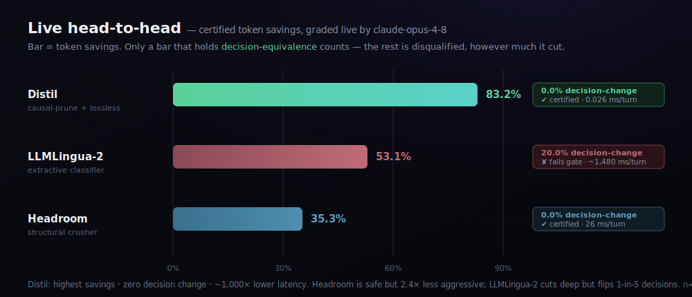
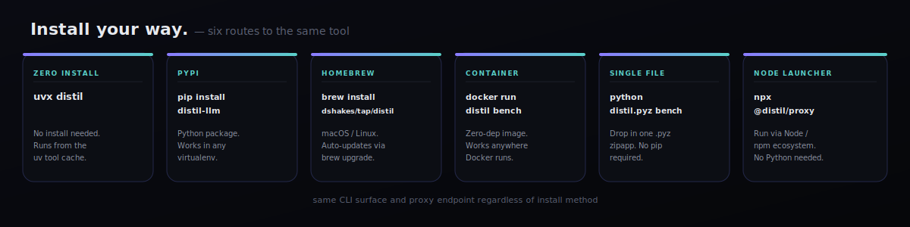
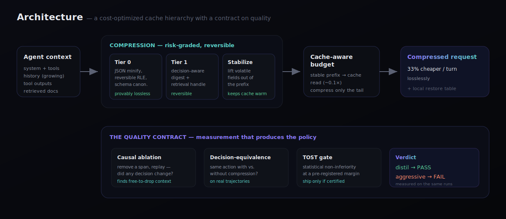
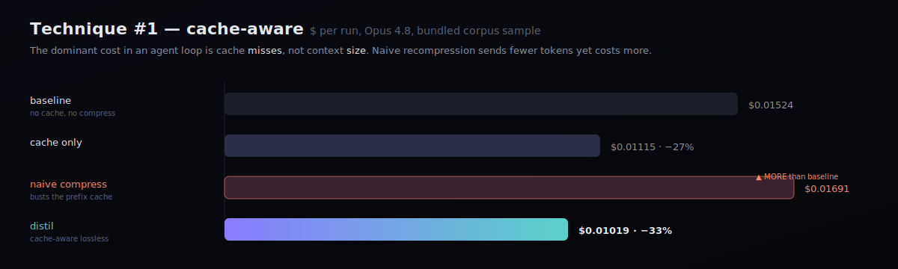
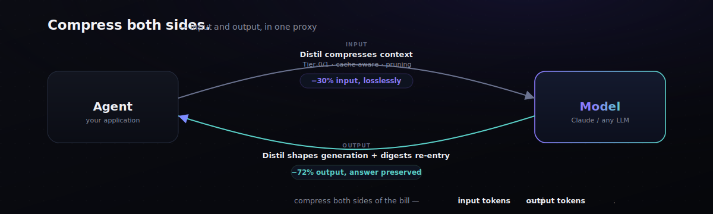

<p align="center">
  
</p>

<p align="center">
  <a href="LICENSE"></a>
  
  
  
  
  
</p>

<h3 align="center">Cut LLM agent costs ~30% — and <em>prove</em> the agent still makes the same decisions.</h3>

<p align="center">
Most context compressors ship a token-savings <em>estimate</em>.<br/>
<strong>Distil ships a quality contract:</strong> a strategy compresses only as far as a statistical non-inferiority test certifies the agent behaves identically — across 7 domains, as a CI gate.
</p>

<p align="center">
  <a href="#-60-second-start">Quickstart</a> ·
  <a href="#-works-with-every-sdk">Integrations</a> ·
  <a href="#-install-your-way">Install</a> ·
  <a href="https://dshakes.github.io/distil/getting-started.html"><b>Full Docs →</b></a>
</p>

---

## 🧭 Pick your lens

<table>
<tr>
<td width="33%" valign="top">

**👔 For decision-makers**

Agents re-send their whole context every turn — you pay for it every turn. Distil cuts that **~27% (up to 33% per domain) with certified zero decision change**, and *proves* it: the savings and the accuracy are measured on the **same runs**, gated in CI. No "trust us."

</td>
<td width="33%" valign="top">

**🛠️ For developers**

`pipx install distil-llm` (or `uvx --from distil-llm distil …`), point your client's `base_url` at the proxy, done — **no code change, any language or SDK**. Or `wrap(client)` in-process. Lossless by default, reversible on demand.

</td>
<td width="33%" valign="top">

**🔬 For researchers**

Compression reframed as **decision-equivalence** and certified with **TOST non-inferiority** + bootstrap CIs over a multi-domain trajectory corpus. Causal ablation discovers what's safe to drop. Reproducible, zero-dep.

</td>
</tr>
</table>

---

## 💡 The one idea

**You don't need byte-equivalence, you need decision-equivalence.** Byte-lossless compression and high savings are information-theoretically in tension. But an agent only has to take the *same actions* and produce the *same outputs* whether or not its context was compressed. That's measurable and certifiable — so **"100% accuracy" becomes a statistical guarantee on outcomes, not a diff of strings.** Everything here makes that real and measured.

---

## 🔑 Distil's structural edge — recoverable compression

Every other compressor — summarizers, extractive pruners, structural crushers — is **lossy**: once it crushes a tool output, the detail is *gone*. Distil **digests behind a content handle and keeps the original locally**, then hands the agent a `distil_expand` tool. Run with `distil proxy --expand` (or `distil wrap --expand`) and:

- **The model pulls back exactly the detail it needs, on demand** — Distil resolves the handle from the local store and re-queries, *transparently*. Your agent code never changes; it just gets the right answer.
- **So you can compress fearlessly.** The dangerous failure mode of lossy compression — "it dropped something load-bearing" — is gone, because the safety net is the model recovering the detail itself.
- **Every expansion is a label.** A `distil_expand` call is ground truth that the digested content *mattered*. Logged (numbers only, never content), these feed a learned policy (`distil learn` shows it) that stops digesting the content *signatures* your agents keep expanding — keeping them byte-exact instead. It only ever makes Distil **more** conservative, so it's never-regressing by construction.

This is the structural advantage: **compress more, lose nothing, and get better the more you use it.** Recoverable compression is uncommon among the lossy tools in this space — and the learning loop compounds on top of it.

---

## ⚡ 60-second start

```bash
uvx --from distil-llm distil bench   # certify savings + quality across 7 domains, in seconds
```

```
domain            trajectory                $ saved   distil   aggr  pruned
---------------------------------------------------------------------------
ops/sre           sre-disk-incident           33.1%     PASS   FAIL     615
coding            coding-bugfix               28.7%     PASS   FAIL     736
support           support-refund              32.6%     PASS   FAIL     765
research          research-synthesis          25.7%     PASS   FAIL     809
data-analysis     data-analysis-sql           18.1%     PASS   FAIL     965
devops            devops-rollback             25.0%     PASS   FAIL     857
finance           finance-reconcile           29.1%     PASS   FAIL    1014
---------------------------------------------------------------------------
aggregate: distil cuts $0.14212 -> $0.10402 (26.8% cheaper) losslessly; 5761 tokens prunable.
GATE: PASS — every trajectory certified non-inferior; aggressive rejected on all.
```

<p align="center"></p>

> **Why trust the number?** Token-savings numbers are easy to fake — measure quality at *low* compression, advertise savings at *high* compression. Distil refuses that: accuracy and compression are measured on the **same** trajectories, and a strategy that can't pass non-inferiority doesn't ship.
> ```
> distil certify --strategy distil       # VERDICT: PASS  (100% decision-equivalence)
> distil certify --strategy aggressive   # VERDICT: FAIL  (mean diff −1.0, blocked)
> ```

### The certified compression frontier — `distil eval`

The artifact no competitor publishes: a savings-vs-quality curve where **every point carries its certification verdict**. It locates the cliff past which lossy compression drops decisions — and shows distil sitting safely inside it. Reproducible offline; run `--runner anthropic` over your ingested traces for live task-accuracy.

```
level                   savings   equiv  certified  curve
--------------------------------------------------------------------------
distil (cache-aware)       8.4%    100%     ✔ PASS   ██
truncate@1200              7.2%     79%        ✘ —    ██
truncate@700              20.0%     36%        ✘ —    ████
truncate@300              41.3%      0%        ✘ —    █████████
--------------------------------------------------------------------------
distil: 8.4% token savings @ 100% decision-equivalence — certified.
(this is the bundled-corpus, cache-aware-only operating point; the varied-corpus
 certified savings are much higher — see the Benchmark section below.)
```

---

## 📊 Benchmark — live, vs the *real* competitor packages

Not reference implementations: the **actual installed packages** (`llmlingua`, `headroom-ai`), each invoked the way that gives it its best fair result, all graded **live by `claude-opus-4-8`** (majority-of-3) on a realistic, decision-determined corpus (5 domains, 120 turns, 4.5–6.5 KB/turn). Same gate for everyone; the decision is the agent's actual next `{action, target}`.

| Method | Token savings | Live decision-change | Certifies ≤5%@95%? | Latency/turn |
|---|--:|--:|:--:|--:|
| **Distil** (causal-prune + lossless) | **83.2%** | **0.0%** | ✅ **yes** | **0.026 ms** |
| LLMLingua-2 (`llmlingua`, real) | 53.1% | 20.0% | ❌ no | ~1,480 ms |
| Headroom (`headroom-ai`, real) | 35.3% | 0.0% | ✅ yes | 26 ms |
| ~~RTK~~ (`rtk-py`) | — | — | excluded¹ | — |

<p align="center"></p>

**Distil is the only method that is simultaneously the most aggressive, fully decision-equivalent, and the lowest-latency** — certified **83.2% savings at a 0% live decision-change rate** (≤5% guaranteed, 95% confidence), ~1,000× faster than the nearest tool. LLMLingua-2 cuts deep but flips **1-in-5** decisions (decision-*unaware*, fails the gate); Headroom is genuinely decision-*safe* but 2.4× less aggressive and loads a ModernBERT scorer. Full methodology, the certified frontier, and the *how-we-certified-and-why-it's-credible* writeup: **[BENCHMARKS.md](BENCHMARKS.md)** · [docs/benchmark](https://dshakes.github.io/distil/benchmark.html). Reproduce: `python benchmarks/gen_realworld.py 30 /tmp/c && python benchmarks/derc_live_compare.py`.

> ¹ **RTK** is a command-output proxy (it compresses `git`/`ls`/`psql` output) with no raw-text mode, so it can't compress arbitrary agent context — a different layer, attempted but not a fair contender. ² The corpus is decision-*determined synthetic* (verified: `byte-exact = 0%` live), realistic in content/size but not a substitute for your own traffic — recalibrate via `distil ingest` → `distil conformal`. The guarantee is marginal over the calibration distribution, not per-prompt.

<details><summary><b>Offline companion</b> — deterministic runner, 64-trajectory corpus, zero API key</summary>

| Technique | Tokens | $ saved | Decision-equiv | Verdict |
|---|--:|--:|--:|---|
| **distil-causal** | 80.5% | **81.5%** | 100% | ✅ certified — leader |
| truncate / sliding-window | 78.7% | 79.6% | 14% | ❌ fails gate |
| **distil-stream** (+ cross-turn dedup) | 61.0% | 61.7% | 100% | ✅ certified |
| **distil-lossless** (fold + template mining) | 57.4% | 58.1% | 100% | ✅ certified · byte-exact |
| summarize / rolling memory | 56.5% | 57.2% | 39% | ❌ fails gate |
| extractive importance (LLMLingua family) | 18.2% | 18.4% | 77% | ❌ fails gate |

Structural (deterministic) grading — fast, free, reproducible by anyone: `python benchmarks/gen_corpus.py && distil benchmark --corpus benchmarks/corpus_xl`. The live numbers above supersede these for aggressive modes.

</details>

**Tune the trade — the equivalence dial.** 100% decision-equivalence is the default, not a wall. Set a lower target and Distil spends a bounded *divergence budget* on the highest-value turns — deeper savings for a **measured, explicit** equivalence cost, with byte-exact fallback everywhere else. The trade is always reported, never hidden:

```
$ distil frontier --corpus benchmarks/corpus_xl
   target   achieved equiv  token savings
     100%             100%          58.1%      ← certified-safe
      80%              82%          62.9%      ← deeper, by an amount you chose
```

---

## 🔌 Works with every SDK

One proxy. Point any `base_url`-honoring client at it — **Python, TypeScript, any language** — and get cache-aware lossless compression with **no code change**.

<p align="center"></p>

```bash
distil proxy --upstream https://api.anthropic.com   # localhost:8788
```

| SDK / framework | Change | Example |
|---|---|---|
| Anthropic SDK (Py/TS) | `base_url="http://127.0.0.1:8788"` | [`examples/python_anthropic.py`](examples/python_anthropic.py) |
| OpenAI SDK | `base_url="http://127.0.0.1:8788/v1"` | [`examples/python_openai.py`](examples/python_openai.py) |
| Vercel AI SDK | `createAnthropic({ baseURL: '…:8788' })` | [`examples/js_vercel_ai_sdk.ts`](examples/js_vercel_ai_sdk.ts) |
| LangChain (py/js) | `anthropicApiUrl` / base URL | [`examples/js_langchain.ts`](examples/js_langchain.ts) |
| LiteLLM | `api_base="http://127.0.0.1:8788"` | [`examples/python_litellm.py`](examples/python_litellm.py) |

Prefer in-process? Wrap the client directly — still no call-site change:

```python
from distil.adapters.anthropic import wrap
client = wrap(anthropic.Anthropic())   # compresses the request, keeps the cache warm
```

---

## 📦 Install your way

<p align="center"></p>

| Format | Command | Prereq |
|---|---|---|
| **Zero install** | `uvx --from distil-llm distil bench` | [uv](https://docs.astral.sh/uv/) |
| **Isolated CLI** | `pipx install distil-llm` → `distil bench` | Python 3.11+, [pipx](https://pipx.pypa.io/) |
| **Homebrew** | `brew install dshakes/tap/distil` | Homebrew |
| **Docker** | `docker build -t distil . && docker run distil bench` | Docker |
| **Single file** | `make pyz` → `python dist/distil.pyz bench` | Python 3.11+ |
| **In a venv** | `pip install distil-llm` (inside an active virtualenv) | Python 3.11+ |

> The import package and CLI are `distil`; the PyPI distribution is `distil-llm` (the bare name was taken — so `uvx`/`pip` must reference `distil-llm`, not `distil`). Distil is a CLI: install it **isolated** (pipx/uv/brew/Docker), because modern macOS/Linux block system-wide `pip install` ([PEP 668](https://peps.python.org/pep-0668/)). **Node / any language:** point your SDK's `base_url` at `distil proxy`, or use `distil wrap -- <agent>` — no Distil-specific package needed.

---

## 🧠 How it works

<p align="center"></p>

Two techniques carry most of the win — they target where the money actually is in an agent loop, not where it looks like it is.

### ① Cache-aware compression — the dominant lever

You re-send the growing context every step. With prompt caching a cache **read is ~10× cheaper** than fresh input, so the real cost is cache **misses**, not context **size**. Distil keeps the prefix byte-stable (schema canonicalization + lifting volatile fields like timestamps/UUIDs out of the prefix) and compresses only the volatile tail.

<p align="center"></p>

> Naive recompression sends **fewer tokens yet costs more than not compressing at all**, because it rewrites the cached prefix every turn. Distil doesn't — that's the whole game most tools miss.

### ② Causal / counterfactual pruning — the discovery engine

The eval isn't a ruler bolted on the side; it's a *discovery engine*. Remove a context block, replay, did any decision change? Blocks that never change a decision are **provably free to drop**.

```bash
distil prune
# doc-0   PRUNE (causally inert)     # speculative retrieval, never cited
# obs-0   keep (changed a decision)  # carries the decision-driving signal
```

---

## 🎓 The certificate — distribution-free decision-equivalence (DERC)

The TOST gate answers *"is this strategy non-inferior on my corpus?"* The **Decision-Equivalence Risk Certificate** answers the operational question on top of it: *"given a risk budget I choose — say, at most a 5% decision-change rate — how aggressively can I compress, with a guarantee that holds on my real traffic?"*

```bash
distil conformal --corpus ./mycorpus --alpha 0.05 --delta 0.05
# ✔ CERTIFIED 'lossless' → 57.4% token savings
# the decision-change rate vs. uncompressed context is ≤ 5.0% with 95% confidence
# (Learn-Then-Test, n=320 calibration turns)
```

It calibrates a ladder of compression levels against your traffic, measures the **decision-change rate** at each (loss = `1` iff the agent's decision flips vs. the uncompressed context, graded by the same runner the gate uses), and selects the most aggressive level whose risk is provably controlled. The machinery is **conformal risk control** — not a heuristic threshold:

- **Learn-Then-Test** (Angelopoulos, Bates, Candès, Jordan & Lei, *Ann. Appl. Stat.* 2025 — [arXiv:2110.01052](https://arxiv.org/abs/2110.01052)). Risk control as multiple hypothesis testing; with Hoeffding–Bentkus p-values + fixed-sequence testing it gives, for the selected level λ̂, **P( R(λ̂) ≤ α ) ≥ 1 − δ** — distribution-free, finite-sample.
- **Conformal Risk Control** (Angelopoulos, Bates, Fisch, Lei & Schuster, *ICLR* 2024 — [arXiv:2208.02814](https://arxiv.org/abs/2208.02814)). For a monotone 0/1 loss, controls the *expected* rate **E[ L(λ̂) ] ≤ α**, tight to O(1/n). Use `--method crc`.

**Why this is novel here:** conformal prediction is established theory, but applying it to **context compression with the loss defined as agent decision-equivalence** is, to our reading of the literature, open white space. The nearest neighbour ([arXiv:2511.17908](https://arxiv.org/abs/2511.17908), ECIR 2026) applies conformal guarantees to **RAG retrieval recall** — a different task (which documents to fetch), not how far you can crush the context an agent already has while it keeps acting the same. Distil turns "100% accuracy" from a slogan into a number with a confidence level attached to it.

> **The one honest caveat (it's load-bearing):** conformal guarantees require **exchangeability** — your calibration traffic must look like your live traffic. Under distribution shift (new agent, prompt change, workload drift) the bound can silently weaken; recalibrate on a rolling window. And the guarantee is **marginal** over the calibration distribution — an average rate, not a per-prompt promise. It's a real statistical guarantee for the distribution you calibrated on, not magic. The certificate is also honestly *conservative*: on a small corpus it will **refuse to certify** a tight α rather than over-claim — give it more calibration turns and the same α certifies (we double-validated this: 320 turns certified `lossless` at α=2%, 640 turns at α=1%).

---

## 🧩 What's inside (real implementations, no stubs)

| Capability | Module | Loss profile |
|---|---|---|
| Cache-aware priced cost engine | `compress/cache_aware.py` | — |
| Schema canonicalization + volatile-field extraction | `compress/stabilize.py` | lossless · reversible |
| Tier-0 reversible transforms · Tier-1 decision-aware digest | `compress/tier0.py`, `tier1.py` | lossless / reversible |
| **Causal / counterfactual pruning** | `replay/ablation.py` | certified |
| **TOST non-inferiority gate** + 7-domain corpus + `distil bench` | `certify/`, `corpus.py` | the contract |
| **Decision-Equivalence Risk Certificate** — conformal risk control (LTT/CRC) | `conformal.py`, `distil conformal` | distribution-free guarantee |
| **Salience protection** — model-free (pattern + entropy + cross-reference), keeps the decision-bearing lines while crushing the rest | `compress/salience.py` | frontier shifter |
| **Provider proxy** — drop-in across SDKs | `proxy.py`, `distil proxy` | reversible |
| **Managed gateway** — multi-tenant + live savings dashboard | `gateway.py`, `distil gateway` | — |
| In-process adapter (`wrap`) | `adapters/anthropic.py` | reversible |
| **Learned keep-model** (logistic, 96.4% / 0.98 F1 on held-out lines; labels distilled from the salience heuristic + bundled corpus) | `codec/learned.py` | pluggable |
| Transformer keep-model — ONNX adapter + training pipeline | `codec/transformer.py`, `codec/train_transformer.py` | pluggable |
| Auth-mode gating (lossless-only on subscription/OAuth) | `policy.py` | safety |
| Holdout A/B savings + bootstrap CI | `certify/holdout.py` | — |
| Byte-fidelity invariants (reversible + append-only) | `fidelity.py`, `distil verify` | — |
| BM25 partial retrieval · delta context · gist caching | `retrieval.py`, `delta.py`, `gist.py` | lossless |
| **Output compression** — gated shaping + lossless re-entry digest + A/B harness | `output.py`, `distil output-savings` | gated / lossless |
| **Real-trace ingestion** — run the gate on your own traffic | `ingest.py`, `distil ingest` | — |
| **Performance benchmark** — p50/p95 latency + throughput | `perf.py`, `distil perf` | — |
| Billing-grade tokenizer + live runner | `tokenizer.py`, `replay/anthropic_runner.py` | opt-in |
| Savings ledger + leaderboard (privacy-preserving) | `ledger.py` | local-first |
| **Certified compression frontier** — savings-vs-accuracy curve | `eval.py`, `distil eval` | the proof |
| **Self-distilling keep-model** — learns from causal labels, gated by the contract | `online.py`, `distil online` | never-regressing |
| **Verifiable federated telemetry** — signed, content-free savings + verdict | `telemetry.py`, `distil federated-leaderboard` | tamper-evident |
| **Async high-concurrency proxy** | `aproxy.py`, `distil proxy --async` | `[async]` extra |
| **Rust hot-path core** + pure-Python parity fallback | `rust/distil-core`, `distil/native.py` | opt-in speed |

**Full docs:** [Getting started](https://dshakes.github.io/distil/getting-started.html) · [Concepts](https://dshakes.github.io/distil/concepts.html) · [Techniques](https://dshakes.github.io/distil/techniques.html) · [CLI](https://dshakes.github.io/distil/cli.html) · [Output & I/O](https://dshakes.github.io/distil/output.html) · [Architecture](https://dshakes.github.io/distil/architecture.html) · [Integrations](https://dshakes.github.io/distil/integrations.html) · [Deploy & security](https://dshakes.github.io/distil/deploy-security.html) · [FAQ](https://dshakes.github.io/distil/faq.html)

---

## 🔒 Security & deployment

- **Localhost-only by default** — the proxy binds `127.0.0.1` and forwards only to the single configured upstream (no SSRF).
- **No secret/body logging** — request bodies and credentials are never logged.
- **Auth-mode gating** — `--lossless-only` keeps subscription/OAuth sessions lossless and never injects tools (provider-ToS-safe).
- **Stateless** — nothing is persisted; ZDR-compatible.

See [Deploy & security](https://dshakes.github.io/distil/deploy-security.html) for topologies (local sidecar, container sidecar, shared gateway) and the threat model.

---

## ✅ What we won't pretend

- **Default tokenizer is an offline heuristic** (zero deps); ratios are robust, dollars are approximate. Use `--tokenizer anthropic` for billing-grade counts (the correct Claude tokenizer — tiktoken undercounts Claude).
- **The default runner is a deterministic stand-in** so the gate runs offline with ground truth. `--runner anthropic` certifies against the live model — implemented, **UNVERIFIED** until you run it with a key.
- The learned keep-model is a real trained **logistic** classifier (96.4%/0.98 on held-out lines). The **transformer** path ships a real ONNX adapter + training pipeline; a **demo checkpoint** (96.3%/0.98, trained on the bundled corpus) is on the v0.1.0 release, and you retrain on your own traces for production (`distil train-transformer`). We don't fabricate weights to claim "done."
- Numbers here are reproducible from the bundled corpus with the heuristic tokenizer. No vanity metrics.

---

## 🎯 Both sides of the bill — input *and* output

<p align="center"></p>

**Input/context** (Tier-0/1, cache stabilization, causal pruning, proxy + adapter) — comprehensive.

**Output** — two real mechanisms (`distil/output.py`):
- **Generation-side shaping** — a gated `role:"system"` verbosity directive (`distil proxy --shape-output light|aggressive`) so the model *emits* fewer tokens. Lossy by nature, so it's **PAYG-only** and **measured**: `distil output-savings` reports the token cut **and** the rate the answer survived, with a bootstrap CI.
- **Lossless output-on-re-entry digest** — long answers that become history are digested reversibly, so verbose past output stops costing full price as context.

```
$ distil output-savings   # live A/B (needs an API key); small sample — verify on your own workload
output tokens cut 72.5% (95% CI 67.5–77.1%), answer preserved across the n=6 sample
```

**Run the gate on *your* traffic, not just the synthetic corpus:**
```
$ distil ingest --input prod-requests.jsonl --out ./mycorpus   # Anthropic/OpenAI logs → trajectories
$ distil bench --corpus ./mycorpus --savings-only
```

**Performance** (`distil perf`, stdlib, single core): ~27,000 distil-compressions/sec; the in-process adapter compresses a request in **~0.006 ms** (p50).

### Honest limits
- **Production keep-model weights.** A logistic model (96.4%/0.98) ships built-in; the transformer is a real adapter + pipeline with a *demo* checkpoint on the [v0.1.0 release](https://github.com/dshakes/distil/releases/tag/v0.1.0) — retrain on your traces (`distil train-transformer`).
- **Output shaping's realized savings are live** — the A/B harness measures it on recorded pairs; the token reduction lands when a real model generates against the directive.
- **Live-model certification** is offline by default; `--runner anthropic` is implemented but **UNVERIFIED** without a key.

No vanity metrics — every number here is reproducible from the bundled corpus.

---

## 🤝 Contributing

PRs welcome — see [CONTRIBUTING.md](CONTRIBUTING.md). The one rule that matters: **a new compression strategy must pass `make gate`** (non-inferior on every domain, byte-reversible). No green gate, no merge. That's the whole philosophy in one sentence.

## License

[Apache-2.0](LICENSE) · *“Same potency, less volume.”*
